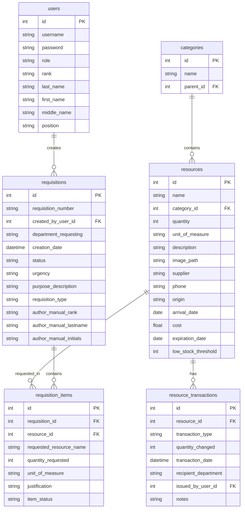

# Система обліку військового майна

## 📋 Опис проекту
Система для обліку та управління військовим майном з функціями створення заявок, відстеження ресурсів та генерації звітів.

## 🏗️ Архітектура

### Структура проекту
```
military_resource_app/
├── logic/           # Бізнес-логіка
│   ├── db_manager.py     # Управління базою даних
│   └── requisition_handler.py  # Обробка заявок
├── ui/             # Інтерфейс користувача
│   ├── login_dialog.py   # Вікно входу
│   ├── main_window.py    # Головне вікно
│   └── requisition_dialog.py  # Вікно заявок
└── assets/         # Ресурси
    └── style.css   # Стилі
```

### Компоненти системи
- **База даних**: SQLite
- **Інтерфейс**: PyQt6
- **Бізнес-логіка**: Python 3.x

## 🔄 Основні процеси
1. Авторизація користувачів
2. Управління ресурсами (додавання, редагування, видалення)
3. Створення та обробка заявок
4. Генерація звітів
5. Відстеження залишків та термінів придатності

## 👥 Ролі користувачів
- **Адміністратор**: Повний доступ до системи
- **Користувач**: Обмежений доступ (створення заявок, перегляд ресурсів)

## 📊 Діаграма бази даних


## 🔒 Безпека
- Хешування паролів
- Контроль доступу на основі ролей
- Логування важливих операцій

## 📈 Масштабування
- Можливість додавання нових типів ресурсів
- Розширення функціоналу звітності
- Інтеграція з іншими системами 